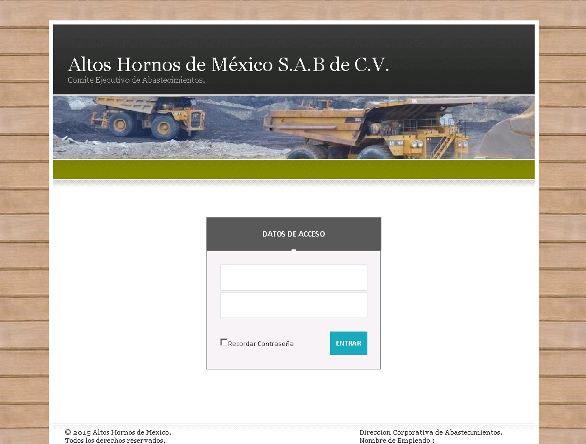
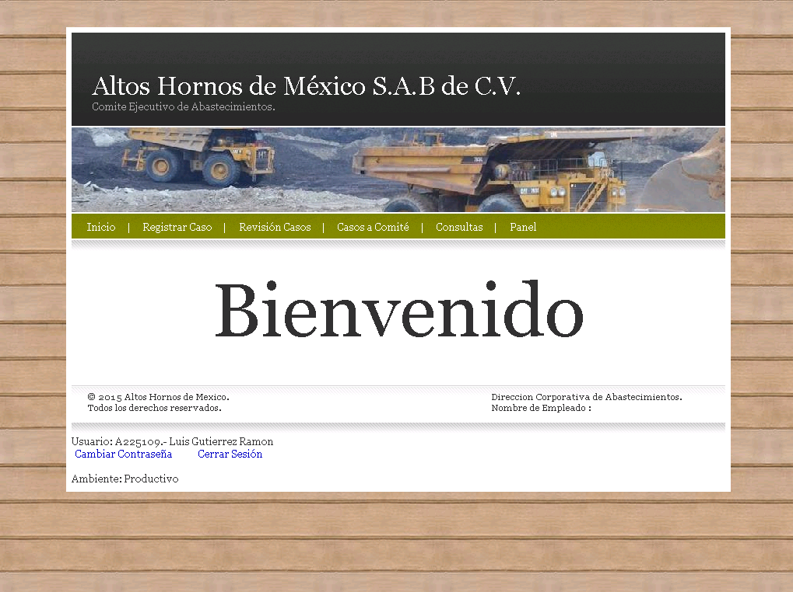
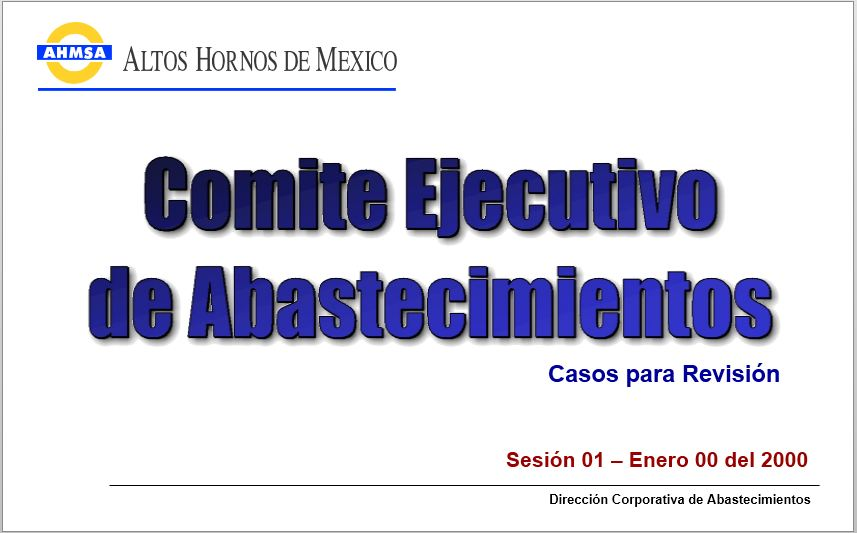
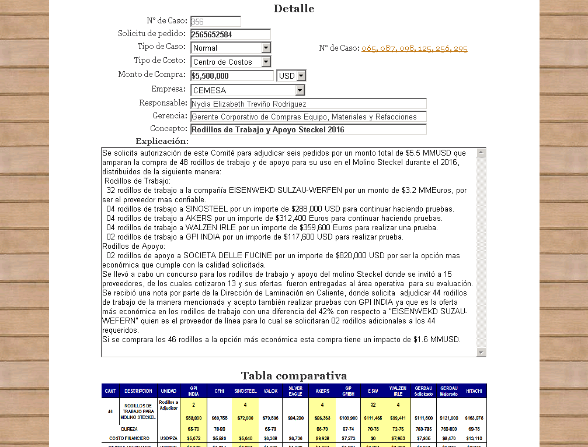

# 🌐 CEA Web

## 🧭 Overview
**CEA Web** is a Windows-based full-screen presentation platform developed in **Visual Basic** using **Visual Studio** for the directors of AHMSA. It complements the CEA Windows app by offering a clean, minimalistic interface to display approved high-value purchase cases during weekly committee sessions.

Developed specifically for Mac users in the general direction, CEA Web allows presenters to showcase each case slide-by-slide in an automated, branded layout designed for clarity and professionalism.

### Login

### Home Page

### Presentation mode

### View Case

### Register Case

## 💡 Idea & Concept
CEA Web was built to:
- Provide a simplified viewing experience on director-provided MacBooks
- Replace PowerPoint slides manually generated each week
- Connect directly to the **[CEA](https://github.com/HermiloOrtega/CEA)** database for real-time, accurate case access
- Deliver a seamless "presentation mode" for use on large screens during weekly procurement reviews

## ✨ Features & Functionality
- 🖥 Presentation Mode:
  - Full-screen display mimicking a PowerPoint experience
  - Automatic slide navigation by case
  - Dedicated view per title, details, and pricing table image
- 🔍 Review Cases:
  - Load only approved and validated cases for committee review
- 📚 Case Details:
  - Vendor info, justification, contract reference, session number, etc.
- 🗃 Archive Access:
  - Browse previously approved or postponed cases
- 🔧 Simple interface for navigation and next/previous control
- ⚙️ Offline Compatibility:
  - Designed to match **[CEA Offline](https://github.com/HermiloOrtega/CEA-Offline)** layout and logic for consistency

## ⚙️ Tech Stack
- **Language:** Visual Basic
- **Framework:** .NET WinForms
- **Database:** SQL Server (shared with **[CEA](https://github.com/HermiloOrtega/CEA)**)
- **IDE:** Visual Studio

## 🏗 Architecture & Design
- Minimal UI with full-screen presentation output
- Syncs to **[CEA](https://github.com/HermiloOrtega/CEA)** DB but restricted to read-only views
- Presentation logic grouped by session and case ID
- Branded theme: white background, dark fonts, institutional styling

## 🚀 Installation & Setup
- **Deployment:** Installed on Mac-compatible Windows environments
- **Access:** Executed manually by the system admin on Monday meetings
- **Requirements:** Local network access to SQL Server + image/media folders

> **Note:** Presentation content is fully locked to avoid runtime edits.

## 🧑‍💻 My Role & Contributions
- 💼 Designed and developed the full platform
- 🧱 Created the multi-slide sequence layout logic
- 🖼 Built image rendering controls and synced views
- 🎯 Matched UX/UI to **[CEA Offline](https://github.com/HermiloOrtega/CEA-Offline)** for fallback compatibility

## 🧗 Challenges & Learnings
- Designed for seamless display during high-stakes executive meetings
- Ensured performance and responsiveness of slide transitions
- Reduced human error in content preparation
- Validated real-time integration without edit permissions

## 📈 Future Enhancements
- Migrate to ASP.NET or WebView2 for broader device support
- Enable touch or remote navigation
- Sync with approval flags from **[CEA](https://github.com/HermiloOrtega/CEA)** to auto-curate presentations

## 🪪 License
⚠️ **Internal Use Only**  
Originally under MIT; changed to **CC BY-NC-ND 4.0** as of April 22, 2025.

## 🔗 Related Projects
- **[CEA](https://github.com/HermiloOrtega/CEA)**
- **[CEA Web](https://github.com/HermiloOrtega/CEA-Web)**
- **[CEA Offline](https://github.com/HermiloOrtega/CEA-Offline)**